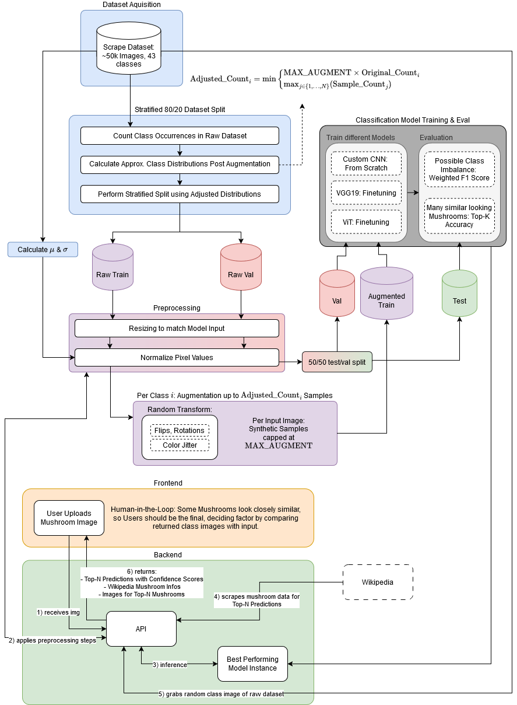
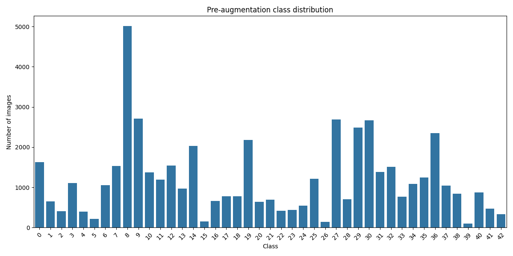
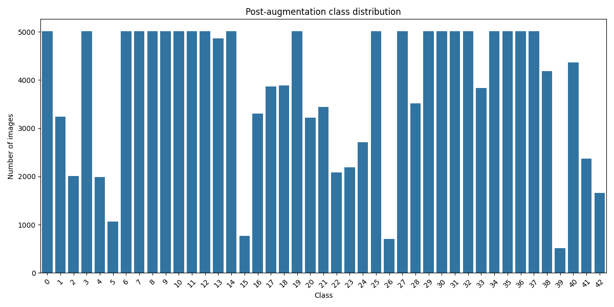
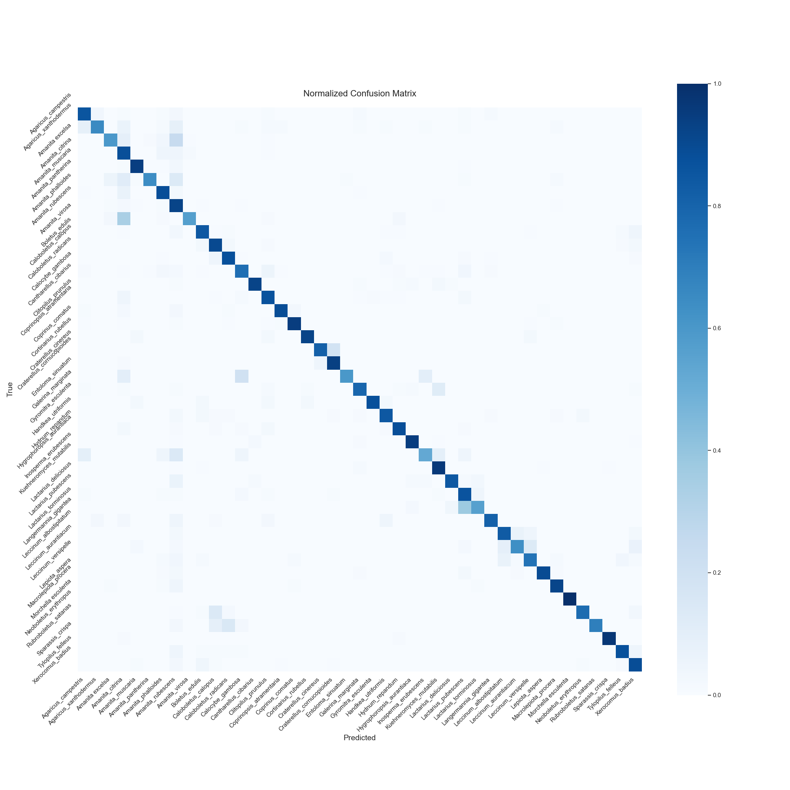

# Advanced Information Retrieval Project @ TU Graz, WS24

## Table of Contents
- [Architecture](#architecture)
- [Config](#config)
- [Training](#training)
  - [Augmentation](#augmentation)
  - [Running the Pipeline](#running-the-pipeline)
  - [Model Artifacts](#model-artifacts)
- [API](#api)
- [AI Usage Disclaimer](#ai-usage-disclaimer)

## Architecture



## Config

The config is located in `backend/src/config.py` and is used to set all kinds of parameters for the entire project (e.g. logging, paths, training parameters, api settings, etc.)
Make sure to check it out before running the pipeline. Important parameters should be annotated.
Once we have chosen a baseline model, we will hyperparameter tune it with the dicts specified in the config. (TODO: move the dicts to separate files for each model)

## Training

During the training pipeline, we populate the `data/intermediate` directory and model artifacts in the `models` directory. Once the splits are created, you can disable the creation of new splits by setting `CREATE_STATIC_SPLITS` to `False` in the config. This will use the existing splits in the `data/intermediate` directory.

The intermediate data entails a static train/val/test split where only the train set is augmented. This is to prevent data leakage during evaluation and testing.

### Augmentation
To reduce class imbalance, we augment underrepresented classes using a dynamic scaling approach. For each class i, we calculate the target number of samples after augmentation using:

```math
\text{AugmentedCount}_i = \min \begin{cases} \text{MAX\_AUGMENT} \cdot \text{OriginalCount}_i, \\ \max_{j \in \text{classes}}(\text{OriginalCount}_j) \end{cases}
```

This approach ensures two key constraints:
1. The augmented sample count for any class never exceeds the size of the largest original class
2. Each original sample is augmented at most MAX_AUGMENT times to maintain data quality

This helps prevent over-augmentation while flattening the class distribution, as shown in the plots below:




### Running the Pipeline
The training pipeline can be run from the command line:

```bash
python backend/run_train_pipeline.py
```

Note: The Jupyter notebook version is outdated and should not be used.

### Model Artifacts

During training, all model artifacts are saved in the `models` directory with the following structure:
```
models/
└── datetime_timestamp/
    ├── cnn/
    │   ├── best_model.pth
    │   ├── metrics.json
    │   └── metrics.png
    ├── vgg19/
    │   ├── best_model.pth
    │   ├── metrics.json
    │   └── metrics.png
    └── vit/
        ├── best_model.pth
        ├── metrics.json
        └── metrics.png
```

For inference, we select the best model from these runs and move it to the `models/final_models` directory, from where we then load the model type and weights.


### Evaluation (ViT only)
Even with the baseline ViT model trained for 2 epochs, we can achieve a very solid performance across all relevant metrics:
```js
{
    "val_f1": 82.82044466135217,
    "val_loss": 0.4800497365387034,
    "val_top3": 100.0,
    "val_top5": 100.0,
    "train_f1": 86.72970789630963,
    "train_loss": 0.4314231148026336
}
```
Very few classes (species) have slightly higher misclassification rates, most likely due to visual similarity:




## API
The Flask API can be started by running:
```bash
python backend/run_flask.py
```

By default, the API is accessible at `http://localhost:5000`. The host address and port can be configured in the config file.
For the scope of this project, we use the Flask development server, which is not recommended for production.

## AI Usage Disclaimer
The docstrings throughout the project were mostly AI generated but were manually validated.

