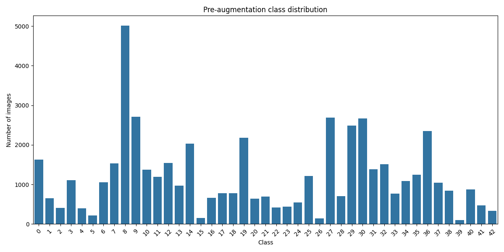
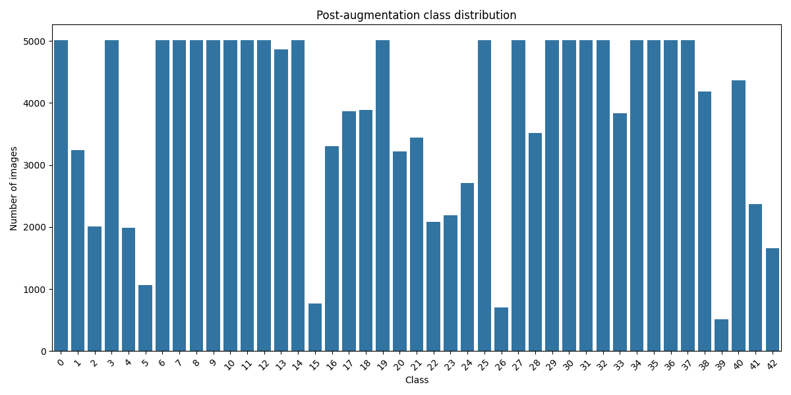

# Advanced Information Retrieval Project @ TU Graz, WS24

## Architecture


## Config

The config is located in `Lukas/src/config.py` and is used to set all kinds of parameters for the entire project (e.g. logging, paths, training parameters, api settings, etc.)
Make sure to check it out before running the pipeline. Important parameters should be annotated.
Once we have chosen a baseline model, we will hyperparameter tune it with the dicts specified in the config. (TODO: move the dicts to separate files for each model)

## Training

During the training pipeline, we populate the `data/intermediate` directory and model artifacts in the `models` directory. Once the splits are created, you can disable the creation of new splits by setting `CREATE_STATIC_SPLITS` to `False` in the config. this will use the existing splits in the `data/intermediate` directory. 
During the training pipeline, we populate the `data/intermediate` directory and model artifacts in the `models` directory. Once the splits are created, you can disable the creation of new splits by setting `CREATE_STATIC_SPLITS` to `False` in the config. this will use the existing splits in the `data/intermediate` directory. 
The intermediate data entails a static train/val/test split where only the train set is augmented. This is to prevent data leakage during eval and test.
<!-- We could implement kfold cv if we want a more robust training loop. -->

### Augmentation
To reduce class imbalance, we augment underrepresented classes using a dynamic scaling approach. For each class i, we calculate the target number of samples after augmentation using:

$$
\text{AugmentedCount}_i = \min \begin{cases} \text{MAX\_AUGMENT} \cdot \text{OriginalCount}_i, \\ \max_{j \in \text{classes}}(\text{OriginalCount}_j) \end{cases}
$$

This approach ensures two key constraints:
1. The augmented sample count for any class never exceeds the size of the largest original class
2. Each original sample is augmented at most MAX_AUGMENT times to maintain data quality

This helps prevent over-augmentation while flattening the class distribution, as shown in the plots below:

<div style="display: flex; justify-content: space-between;">
    <div>
        <p>Before augmentation:</p>
        
    </div>
    <div>
        <p>After augmentation:</p>
        
    </div>
</div>

### Running the pipeline
The ipynb is outdated, the pipeline is now run from the command line.

```bash
python Lukas/run_train_pipeline.py
```

### Model artifacts

during training, the model weights are saved in the `models` directory, the confusion matrices are saved in the `plots/confusion_matrices` directory and the evaluation results are saved in the `plots/evaluations` directory.

```
models/
└── datetime_timestamp/
    ├── cnn/
    │   └── best_model.pth
    ├── vgg19/
    │   └── best_model.pth
    └── vit/
        └── best_model.pth

plots/
├── confusion_matrices/
│   └── confusion_matrix_model_timestamp.png
└── evaluations/
    └── evaluation_results_timestamp.json
```

