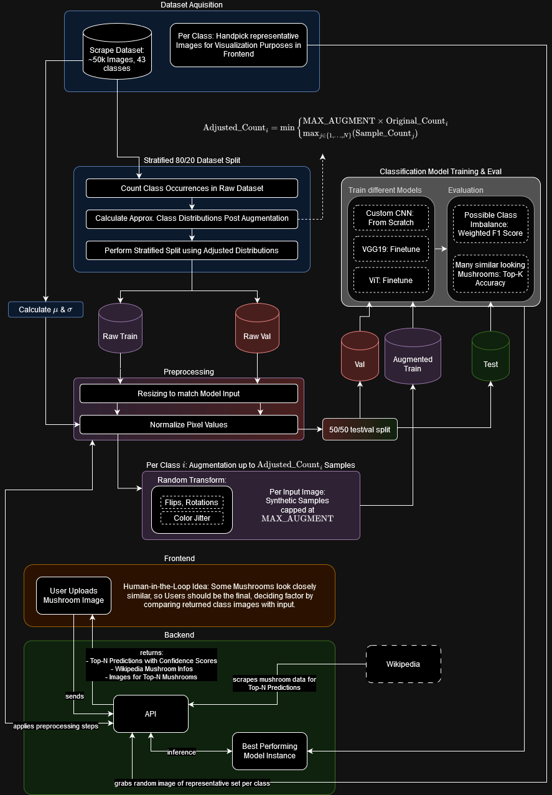

# Advanced Information Retrieval Project @ TU Graz, WS24

## Architecture



## Config

The config is located in `Lukas/src/config.py` and is used to set all kinds of parameters for the entire project (e.g. logging, paths, training parameters, api settings, etc.)
Make sure to check it out before running the pipeline. Important parameters should be annotated.
Once we have chosen a baseline model, we will hyperparameter tune it with the dicts specified in the config. (TODO: move the dicts to separate files for each model)

## Training

During the training pipeline, we create intermediate data in the `data/intermediate` directory and model artifacts in the `models` directory.
The intermediate data entails a static train/val/test split where only the train set is augmented. This is to prevent data leakage during eval and test.
We could implement kfold cv if we want a more robust training loop.

### Running the pipeline
The ipynb is outdated, the pipeline is now run from the command line.

```bash
python Lukas/run_train_pipeline.py
```

### Model artifacts

during training, the model weights are saved in the `models` directory, the confusion matrices are saved in the `plots/confusion_matrices` directory and the evaluation results are saved in the `plots/evaluations` directory.

```
models/
└── datetime_timestamp/
    ├── cnn/
    │   └── best_model.pth
    ├── vgg19/
    │   └── best_model.pth
    └── vit/
        └── best_model.pth

plots/
├── confusion_matrices/
│   └── confusion_matrix_model_timestamp.png
└── evaluations/
    └── evaluation_results_timestamp.json
```

